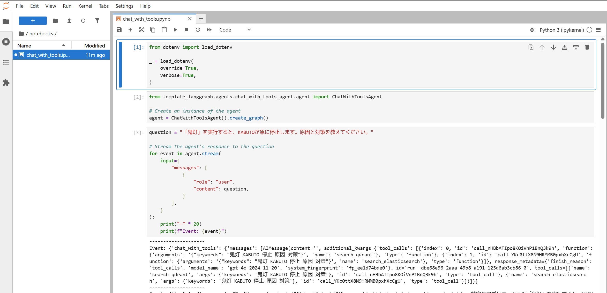

# LangGraph AI エージェント テンプレート

[LangGraph](https://langchain-ai.github.io/langgraph/)を使用して AI エージェントを構築するための包括的なテンプレートプロジェクト。様々なエージェントパターン、ツール統合、実際のユースケースを実演します。

## LangGraph とは？

[LangGraph](https://langchain-ai.github.io/langgraph/)は[LangChain](https://python.langchain.com/)の上に構築されたフレームワークで、ステートフルなマルチエージェントワークフローを作成できます。単一のインタラクションを処理する従来のチャットボットとは異なり、LangGraph では以下のような複雑な AI システムを構築できます：

- 複数のターンにわたって会話状態を維持
- ツールと外部 API の使用
- 複雑な推論パターンの実装
- 複数の AI エージェントの協調
- 循環ワークフローと条件ロジックの処理

このテンプレートは、トラブルシューティングシナリオ用の架空のシステム「KABUTO」を使用して、これらの機能を実際の例で示しています。

## プロジェクト概要

このプロジェクトは、シンプルなツール呼び出しエージェントから複雑なマルチエージェントシステムまで、異なる AI エージェントパターンとアーキテクチャを紹介しています。例では、エージェントが複数のデータソースから情報を取得し、構造化された回答を提供する方法を示すために、架空の技術サポートシナリオを使用しています。

### このテンプレートが存在する理由

多くの AI アプリケーションは以下のことが必要です：

1. **外部情報へのアクセス** - LLM は特定のデータにアクセスできません
2. **ツールの使用** - テキスト生成以外のアクションを実行
3. **コンテキストの維持** - 以前のインタラクションを記憶
4. **複雑なワークフローの処理** - タスクを管理可能なステップに分解

このテンプレートは、LangGraph を使用してこれらすべてのパターンの動作例を提供しています。

## 前提条件

- [Python 3.10+](https://www.python.org/downloads/)
- [uv](https://docs.astral.sh/uv/getting-started/installation/) - モダンな Python パッケージマネージャー
- [GNU Make](https://www.gnu.org/software/make/) - 一般的なタスクの実行用
- [Docker](https://www.docker.com/) - ベクターデータベースの実行用（オプション）

## クイックスタート

### 1. 環境設定

```shell
# リポジトリをクローン
git clone https://github.com/ks6088ts-labs/template-langgraph.git
cd template-langgraph

# Python依存関係をインストール
uv sync --all-extras

# 環境設定を作成
cp .env.template .env
# .envを編集してAPIキー（Azure OpenAIなど）を設定
```

### 2. サポートサービスの開始（オプション）

完全な機能のために、ベクターデータベースを開始します：

```shell
# DockerでQdrantとElasticsearchを開始
docker compose up -d
```

### 3. データソースの初期化

**Qdrant ベクターデータベースの設定:**

```shell
uv run python scripts/qdrant_operator.py add-documents \
  --collection-name qa_kabuto \
  --verbose
```

**Elasticsearch 検索インデックスの設定:**

```shell
uv run python scripts/elasticsearch_operator.py create-index \
  --index-name docs_kabuto \
  --verbose
```

## プロジェクト構造

### コアコンポーネント

- **`data/`** - 架空の KABUTO システム用のサンプルデータ（PDF、FAQ、トラブルシューティングガイド）
- **`template_langgraph/`** - すべてのエージェント実装を含むメイン Python パッケージ
- **`notebooks/`** - インタラクティブな例と説明付き Jupyter ノートブック
- **`scripts/`** - エージェント実行用コマンドラインツール

### エージェントの例（`template_langgraph/agents/`）

このプロジェクトには、それぞれ異なる LangGraph パターンを実演する複数のエージェント実装が含まれています：

#### 1. `kabuto_helpdesk_agent/` - **ここから始めよう！**

LangGraph の事前構築された`create_react_agent`関数を使用したシンプルなエージェント。基本を理解するのに最適な出発点です。

**主要概念:** ReAct パターン、ツール呼び出し、事前構築エージェント

#### 2. `chat_with_tools_agent/` - **コア実装**

ヘルプデスクエージェントと同じロジックの手動実装で、LangGraph ワークフローがゼロから構築される方法を示しています。

**主要概念:** グラフ構築、状態管理、ノード関数、エッジ

#### 3. `issue_formatter_agent/` - **構造化出力**

Pydantic モデルを使用して AI 応答から構造化データを取得する方法を実演しています。

**主要概念:** 構造化出力、データ検証、レスポンス形式設定

#### 4. `task_decomposer_agent/` - **計画と分解**

複雑なタスクを小さく管理可能なステップに分解する方法を示しています。

**主要概念:** タスク計画、マルチステップ推論、条件付きワークフロー

#### 5. `supervisor_agent/` - **マルチエージェント協調**

1 つのエージェントが複数の専門エージェントを協調させるスーパーバイザーパターンを実装しています。

**主要概念:** マルチエージェントシステム、エージェント協調、スーパーバイザーパターン

### サポートモジュール

- **`template_langgraph/llms/`** - LLM API ラッパー（Azure OpenAI など）
- **`template_langgraph/tools/`** - 検索、データ取得用ツール実装
- **`template_langgraph/utilities/`** - ドキュメント読み込みと処理用ヘルパー関数

## 例の実行

### オプション 1: LangGraph Studio（開発用推奨）

[LangGraph Studio](https://langchain-ai.github.io/langgraph/concepts/langgraph_studio/)は、エージェントの開発とデバッグのためのビジュアルインターフェースを提供します：

```shell
uv run langgraph dev
```

これにより、以下が可能な Web インターフェースが開きます：

- エージェントワークフローの可視化
- 実行のステップスルー
- 状態遷移のデバッグ
- 異なる入力のテスト


### オプション 2: Jupyter ノートブック（学習に最適）

説明と例付きのインタラクティブノートブック：

```shell
uv run jupyter lab
# http://localhost:8888 に移動し、notebooks/*.ipynbを開く
```



### オプション 3: コマンドライン（本番環境的）

ターミナルからエージェントを実行：

```shell
uv run python scripts/agent_operator.py run \
  --name "chat_with_tools_agent" \
  --question "KABUTO startup issue: screen flashes purple and system freezes" \
  --verbose
```

エージェントの推論プロセスを示す出力例：

```text
Event: {'chat_with_tools': {'messages': [AIMessage(content='', tool_calls=[
  {'name': 'search_elasticsearch', 'args': {'keywords': 'KABUTO startup purple flashing freeze'}},
  {'name': 'search_qdrant', 'args': {'keywords': 'KABUTO startup purple flashing freeze'}}
])]}}

Event: {'tools': {'messages': [ToolMessage(content='Found documentation about startup protocol...')]}}

Event: {'chat_with_tools': {'messages': [AIMessage(content='
### 問題分析
KABUTO起動時の紫画面点滅は「忍者プロトコル」初期化エラーを示しています...

### 解決策
1. **周辺機器の切断**: すべての接続デバイスを5秒以上取り外す
2. **外部クロックキャッシュのクリア**: クロック同期問題を解決
3. **KABUTOの再起動**: 必要に応じて「ドラゴンボール」ボタンを5秒以上押す
')]}}
```

## 実演されている主要概念

### 1. **ReAct パターン**（推論 + 行動）

現代の AI エージェントの基盤 - 何をすべきかを推論し、行動を取り、結果について推論する能力。

### 2. **ツール呼び出し**

エージェントが外部関数を使用する方法：

- データベース検索（Elasticsearch、Qdrant）
- API 呼び出し
- ファイル処理
- 計算実行

### 3. **状態管理**

LangGraph が複数のインタラクションステップにわたってコンテキストを維持し、複雑なマルチターン会話を可能にする方法。

### 4. **条件付きワークフロー**

エージェントの決定や外部条件に基づく分岐ロジックを作成するためのグラフ構造の使用。

### 5. **マルチエージェントシステム**

異なる専門知識を必要とする複雑なタスクを処理するための複数の専門エージェントの協調。

## データソースの説明

プロジェクトは実際のシナリオを実演するために「KABUTO」というシステムについての架空のデータを使用しています：

- **`data/docs_kabuto.pdf`** - 技術文書（ユーザーマニュアルをシミュレート）
- **`data/qa_kabuto.csv`** - FAQ データベース（過去のサポートチケットをシミュレート）
- **`data/docs_kabuto.md`** - 追加文書

この架空のデータには目的があります：AI エージェントが LLM の訓練データにない情報で動作できることを証明し、検索拡張生成（RAG）の価値を実演しています。

## 次のステップ

1. **基本から始める**: `kabuto_helpdesk_agent`の例を実行
2. **実装を理解する**: `chat_with_tools_agent`と比較
3. **高度なパターンを探索**: タスク分解器とスーパーバイザーエージェントを試す
4. **独自のものを構築**: このテンプレートをあなたのユースケースの出発点として使用

## 学習リソース

- [LangGraph 文書](https://langchain-ai.github.io/langgraph/)
- [LangChain 文書](https://python.langchain.com/)

## アーキテクチャの例

このテンプレートは複数の実証済みエージェントアーキテクチャを実演しています：

1. **ツール付きシングルエージェント** - 基本的なツール呼び出しパターン
2. **ReAct エージェント** - ループでの推論と行動
3. **構造化出力エージェント** - フォーマットされたデータの返却
4. **計画エージェント** - 複雑なタスクの分解
5. **スーパーバイザーエージェント** - 複数エージェントの協調

各パターンは、いつどのように使用するかを理解するのに役立つ明確な例と文書で実装されています。
