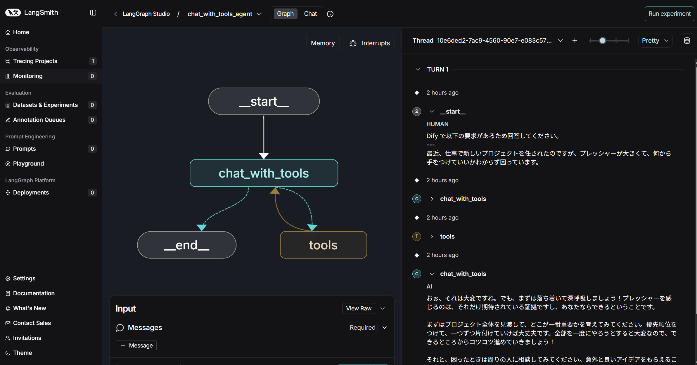
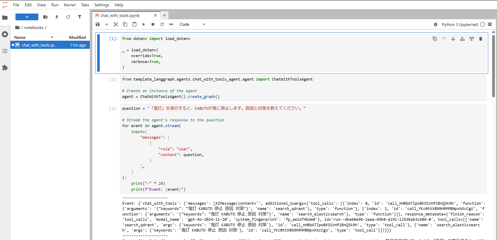
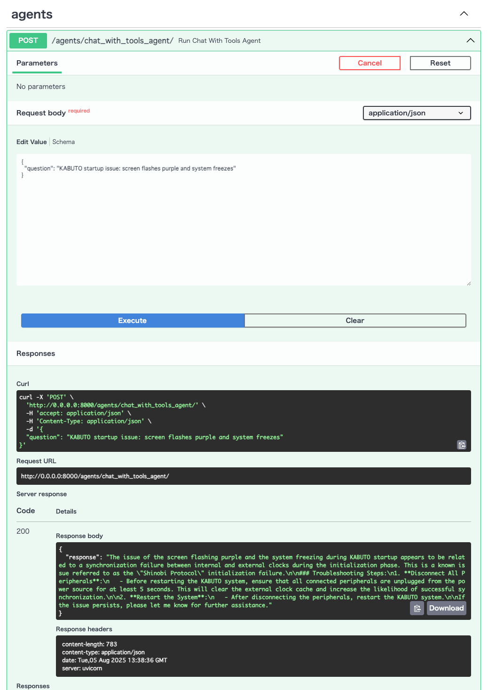
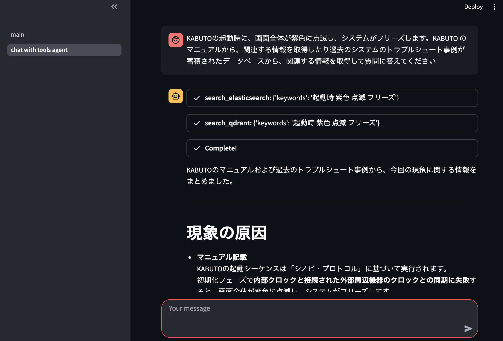

# LangGraph AI Agent Template

A comprehensive template project for building AI agents using [LangGraph](https://langchain-ai.github.io/langgraph/), demonstrating various agent patterns, tool integration, and real-world use cases.

## What is LangGraph?

[LangGraph](https://langchain-ai.github.io/langgraph/) is a framework built on top of [LangChain](https://python.langchain.com/) that enables you to create stateful, multi-agent workflows. Unlike traditional chatbots that handle single interactions, LangGraph allows you to build complex AI systems that can:

- Maintain conversation state across multiple turns
- Use tools and external APIs
- Implement complex reasoning patterns
- Coordinate multiple AI agents
- Handle cyclical workflows and conditional logic

This template demonstrates these capabilities through practical examples using a fictional system called "KABUTO" for troubleshooting scenarios.

## Project Overview

This project showcases different AI agent patterns and architectures, from simple tool-calling agents to complex multi-agent systems. The examples use a fictional technical support scenario to demonstrate how agents can retrieve information from multiple data sources and provide structured responses.

### Why This Template Exists

Most AI applications need to:

1. **Access external information** - LLMs don't have access to your specific data
2. **Use tools** - Perform actions beyond text generation
3. **Maintain context** - Remember previous interactions
4. **Handle complex workflows** - Break down tasks into manageable steps

This template provides working examples of all these patterns using LangGraph.

## Prerequisites

- [Python 3.10+](https://www.python.org/downloads/)
- [uv](https://docs.astral.sh/uv/getting-started/installation/) - Modern Python package manager
- [GNU Make](https://www.gnu.org/software/make/) - For running common tasks
- [Docker](https://www.docker.com/) - For running vector databases (optional)
- Azure
  - [Azure OpenAI](https://learn.microsoft.com/ja-jp/azure/ai-foundry/openai/overview) - LLM API
  - [Azure Cosmos DB](https://learn.microsoft.com/ja-jp/azure/cosmos-db/) - Data storage (optional)

## Quick Start

### 1. Environment Setup

```shell
# Clone the repository
git clone https://github.com/ks6088ts-labs/template-langgraph.git
cd template-langgraph

# Install Python dependencies
uv sync --all-extras

# Create environment configuration
cp .env.template .env
# Edit .env with your API keys (Azure OpenAI, etc.)
```

### 2. Start Supporting Services (Optional)

For full functionality, start the vector databases:

```shell
# Start Qdrant and Elasticsearch using Docker
docker compose up -d
```

### 3. Initialize Data Sources

**Set up Qdrant vector database:**

```shell
uv run python scripts/qdrant_operator.py add-documents \
  --collection-name qa_kabuto \
  --verbose
```

**Set up Elasticsearch search index:**

```shell
uv run python scripts/elasticsearch_operator.py create-index \
  --index-name docs_kabuto \
  --verbose
```

**Optional: Set up additional data sources:**

```shell
# Azure AI Search
make create-ai-search-index

# Azure Cosmos DB  
make create-cosmosdb-index

# Or use the operator scripts directly:
# uv run python scripts/ai_search_operator.py add-documents --verbose
# uv run python scripts/cosmosdb_operator.py add-documents --verbose
```

## Project Structure

### Core Components

- **`data/`** - Sample data for the fictional KABUTO system (PDFs, FAQs, troubleshooting guides)
- **`template_langgraph/`** - Main Python package containing all agent implementations
- **`notebooks/`** - Jupyter notebooks with interactive examples and explanations
- **`scripts/`** - Command-line tools for running agents
  - `agent_operator.py` - Main agent runner for production agents
  - `demo_agents_operator.py` - Runner for simple demo agents
  - Database/search operators (`qdrant_operator.py`, `elasticsearch_operator.py`, `ai_search_operator.py`, `cosmosdb_operator.py`)
  - LLM testing operators (`azure_openai_operator.py`, `azure_ai_foundry_operator.py`, `ollama_operator.py`)
  - Other utilities (`dify_operator.py`, `otel_operator.py`)

### Agent Examples (`template_langgraph/agents/`)

This project includes several agent implementations, each demonstrating different LangGraph patterns. You can render their graphs to PNG via the CLI (see Deployment) and run them from the terminal or Makefile targets.

- `kabuto_helpdesk_agent/` — Start here. Prebuilt ReAct agent via `create_react_agent`. Key: ReAct, tool calling, prebuilt agents.
- `chat_with_tools_agent/` — Core implementation. Manual graph building equivalent to the helpdesk agent. Key: graph construction, state, nodes/edges.
- `issue_formatter_agent/` — Structured output. Extracts structured data via Pydantic. Key: structured output, validation, formatting.
- `task_decomposer_agent/` — Planning & decomposition. Breaks down complex tasks into steps. Key: planning, multi-step reasoning, conditional flows.
- `supervisor_agent/` — Multi-agent coordination. Supervisor orchestrates multiple specialists. Key: multi-agent coordination.
- `news_summarizer_agent/` — Web/YouTube summarization. Scrapes content, summarizes to `StructuredArticle`, and notifies. Key: fan-out subtasks, notifier/scraper/summarizer plugins.
- `image_classifier_agent/` — Vision classification. Classifies local images and notifies results. Key: LLM-based image classification, parallel subtasks.

#### Demo Agents (`template_langgraph/agents/demo_agents/`)

Additional simple agents for learning and demonstration:

- `weather_agent.py` — Simple tool-calling agent. Basic ReAct pattern with mock weather search tool. Key: tool calling, basic agent pattern.
- `multi_agent.py` — Multi-agent coordination. Demonstrates agent-to-agent handoff using transfer functions. Key: agent coordination, workflow transfer.
- `parallel_processor_agent/` — Task decomposition with parallel execution. Breaks down goals into tasks and processes them in parallel. Key: parallel processing, task decomposition, Send operations.

### Supporting Modules

- `template_langgraph/llms/`: LLM wrappers (Azure OpenAI, Azure AI Foundry, Ollama)
- `template_langgraph/tools/`: Tool implementations used by agents
  - Azure AI Search (`ai_search_tool.py`)
  - Azure Cosmos DB Vector Search (`cosmosdb_tool.py`)
  - Dify Workflow (`dify_tool.py`)
  - Elasticsearch full-text search (`elasticsearch_tool.py`)
  - MCP client (Model Context Protocol) (`mcp_tool.py`)
  - Qdrant vector search (`qdrant_tool.py`)
  - SQL Database toolkit (conditional; enabled when DSN provided) (`sql_database_tool.py`)
- `template_langgraph/internals/`: Internal utilities
  - Notifiers (Mock/Slack)
  - Scrapers (Mock/HTTPX/YouTube transcript)
  - Summarizers (Mock/LLM structured output)
  - Loaders (CSV/PDF), OTEL helpers

## Running the Examples

### Option 1: LangGraph Studio (Recommended for Development)

[LangGraph Studio](https://langchain-ai.github.io/langgraph/concepts/langgraph_studio/) provides a visual interface for developing and debugging agents:

```shell
uv run langgraph dev
```

This opens a web interface where you can:

- Visualize agent workflows
- Step through executions
- Debug state transitions
- Test different inputs



### Option 2: Jupyter Notebooks (Best for Learning)

Interactive notebooks with explanations and examples:

```shell
uv run jupyter lab
# Navigate to http://localhost:8888 and open notebooks/*.ipynb
```



### Option 3: Command Line (Quick development)

Run agents from the terminal:

```shell
uv run python scripts/agent_operator.py run \
  --name "chat_with_tools_agent" \
  --question "KABUTO startup issue: screen flashes purple and system freezes" \
  --verbose
```

Example output showing the agent's reasoning process:

```text
Event: {'chat_with_tools': {'messages': [AIMessage(content='', tool_calls=[
  {'name': 'search_elasticsearch', 'args': {'keywords': 'KABUTO startup purple flashing freeze'}},
  {'name': 'search_qdrant', 'args': {'keywords': 'KABUTO startup purple flashing freeze'}}
])]}}

Event: {'tools': {'messages': [ToolMessage(content='Found documentation about startup protocol...')]}}

Event: {'chat_with_tools': {'messages': [AIMessage(content='
### Problem Analysis
The purple screen flashing during KABUTO startup indicates a "Shinobi Protocol" initialization failure...

### Solution
1. **Disconnect peripheral devices**: Unplug all connected devices for 5+ seconds
2. **Clear external clock cache**: This resolves clock synchronization issues
3. **Restart KABUTO**: Use the "Dragon Ball" button for 5+ seconds if needed
')]}}
```

### Option 4: FastAPI (Production-ready)

Run the FastAPI server to expose the agent as an API:

```shell
uv run fastapi run \
  --host "0.0.0.0" \
  --port 8000 \
  --workers 4 \
  template_langgraph/services/fastapis/main.py
# Access the API at http://localhost:8000/docs via Swagger UI
```

This allows you to interact with the agent programmatically via HTTP requests.



### Option 5: Streamlit (PoC demo)

Run the Streamlit app to expose the agent as a web interface:

```shell
uv run streamlit run \
  template_langgraph/services/streamlits/main.py
```

Demonstration of the Streamlit app:

[](https://youtu.be/undxBwyJ3Sc)

### More agent runs

- Issue formatter (structured output):

```shell
uv run python scripts/agent_operator.py run \
  --name issue_formatter_agent \
  --question "KABUTO login fails...（省略）" \
  --verbose
```

- News summarizer (fan-out over URLs):

```shell
uv run python scripts/agent_operator.py news-summarizer-agent \
  --prompt "日本語で3行に要約してください" \
  --urls "https://example.com/a,https://example.com/b" \
  --verbose
```

- Image classifier (classify local images):

```shell
uv run python scripts/agent_operator.py image-classifier-agent \
  --prompt "画像の内容を3行で説明してください" \
  --file-paths "docs/images/fastapi.png,docs/images/streamlit.png" \
  --verbose
```

### Demo agent runs

- Weather agent (simple tool calling):

```shell
uv run python scripts/demo_agents_operator.py weather-agent \
  --query "What's the weather in Japan?" \
  --verbose
```

- Multi agent (agent coordination):

```shell
uv run python scripts/demo_agents_operator.py multi-agent \
  --query "What's the weather in Tokyo?" \
  --verbose
```

- Parallel processor agent (task decomposition):

```shell
uv run python scripts/demo_agents_operator.py parallel-processor-agent \
  --goal "Plan information gathering strategy for launching a software company" \
  --verbose
```

Makefile shortcuts are also available (e.g., `make run-chat-with-tools-agent`, `make run-issue-formatter-agent`, `make run-news-summarizer-agent`, `make run-image-classifier-agent`).

## Key Concepts Demonstrated

### 1. **ReAct Pattern** (Reasoning + Acting)

The foundation of modern AI agents - the ability to reason about what to do, take actions, and reason about the results.

### 2. **Tool Calling**

How agents can use external functions to:

- Search databases (Elasticsearch, Qdrant)
- Call APIs
- Process files
- Execute calculations

### 3. **State Management**

How LangGraph maintains context across multiple interaction steps, enabling complex multi-turn conversations.

### 4. **Conditional Workflows**

Using graph structures to create branching logic based on agent decisions or external conditions.

### 5. **Multi-Agent Systems**

Coordinating multiple specialized agents to handle complex tasks that require different expertise.

## Data Sources Explained

The project uses fictional data about a system called "KABUTO" to demonstrate real-world scenarios:

- **`data/docs_kabuto.pdf`** - Technical documentation (simulates user manuals)
- **`data/qa_kabuto.csv`** - FAQ database (simulates past support tickets)
- **`data/docs_kabuto.md`** - Additional documentation

This fictional data serves a purpose: it proves that the AI agents can work with information that isn't in the LLM's training data, demonstrating the value of retrieval-augmented generation (RAG).

## Tools and configuration

The default toolset is configured in `template_langgraph/tools/common.py` and includes search, vector, workflow, SQL (optional), and MCP tools. Tools are enabled/configured via environment variables in `.env`:

- Azure OpenAI
  - `AZURE_OPENAI_ENDPOINT`, `AZURE_OPENAI_API_KEY`, `AZURE_OPENAI_API_VERSION`
  - `AZURE_OPENAI_MODEL_CHAT`, `AZURE_OPENAI_MODEL_EMBEDDING`, `AZURE_OPENAI_MODEL_REASONING`
  - Optional Entra ID auth: `AZURE_OPENAI_USE_MICROSOFT_ENTRA_ID=true`
- Azure AI Foundry
  - `AZURE_AI_FOUNDRY_INFERENCE_ENDPOINT`, `AZURE_AI_FOUNDRY_INFERENCE_API_VERSION`
  - `AZURE_AI_FOUNDRY_INFERENCE_MODEL_CHAT`
- Ollama (local)
  - `OLLAMA_MODEL_CHAT`
- Azure AI Search
  - `AI_SEARCH_ENDPOINT`, `AI_SEARCH_KEY`, `AI_SEARCH_INDEX_NAME`
- Azure Cosmos DB (vector)
  - `COSMOSDB_HOST`, `COSMOSDB_KEY`, `COSMOSDB_DATABASE_NAME`, `COSMOSDB_CONTAINER_NAME`, `COSMOSDB_PARTITION_KEY`
- Elasticsearch
  - `ELASTICSEARCH_URL` (default `http://localhost:9200`)
- Qdrant
  - `QDRANT_URL` (default `http://localhost:6333`)
- SQL Database (optional)
  - `SQL_DATABASE_URI` (if empty, SQL tools are disabled)
- Dify
  - `DIFY_BASE_URL`, `DIFY_API_KEY`
- MCP (Model Context Protocol)
  - `MCP_CONFIG_PATH` (JSON config; tools loaded dynamically)
- Notifier/Scraper/Summarizer switches
  - `NOTIFIER_TYPE` (`mock`/`slack`), `NOTIFIER_SLACK_WEBHOOK_URL`
  - `SCRAPER_TYPE` (`mock`/`httpx`/`youtube_transcript`)
  - `SUMMARIZER_TYPE` (`mock`/`llm`)

See `.env.template` for a complete list. Most values have sensible local defaults for Docker-based development.

### MCP tools quickstart

If `MCP_CONFIG_PATH` is set to a config file, the agent will automatically load MCP server tools. You can inspect/test MCP servers locally:

```shell
make mcp-inspector
```

## Next Steps

1. **Start with the basics**: Run the `kabuto_helpdesk_agent` example
2. **Try demo agents**: Explore the simple patterns with `weather_agent`, `multi_agent`, and `parallel_processor_agent`
3. **Understand the implementation**: Compare it with `chat_with_tools_agent`
4. **Explore advanced patterns**: Try the task decomposer and supervisor agents
5. **Build your own**: Use this template as a starting point for your use case

## Observability (optional)

OpenTelemetry helpers are available (`template_langgraph/internals/otel_helpers.py`). Try a quick span flow:

```shell
uv run python scripts/otel_operator.py run -q "health check" -v
```

## Learning Resources

- [LangGraph Documentation](https://langchain-ai.github.io/langgraph/)
- [LangChain Documentation](https://python.langchain.com/)

## Architecture Examples

This template demonstrates several proven agent architectures:

1. **Single Agent with Tools** - Basic tool-calling pattern (`weather_agent`)
2. **ReAct Agent** - Reasoning and acting in loops (`kabuto_helpdesk_agent`)
3. **Structured Output Agent** - Returning formatted data (`issue_formatter_agent`)
4. **Planning Agent** - Breaking down complex tasks (`task_decomposer_agent`)
5. **Multi-Agent Systems** - Coordinating multiple agents (`supervisor_agent`, `multi_agent`)
6. **Parallel Processing** - Concurrent task execution (`parallel_processor_agent`)

Each pattern is implemented with clear examples and documentation to help you understand when and how to use them.
